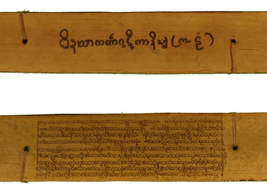
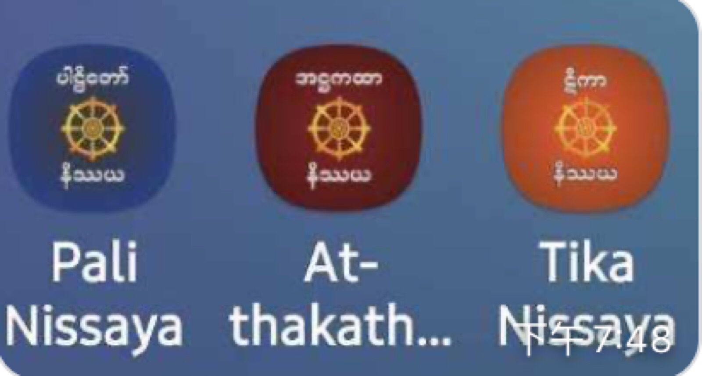
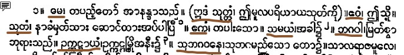
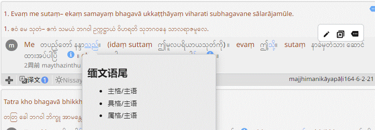
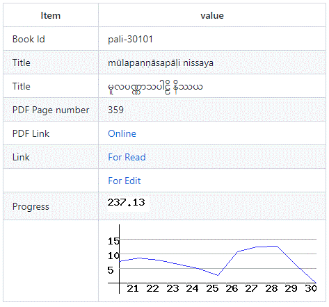

# Digital Nissaya Prject
# 数字Nissaya项目

## 前言
## Introction

>Vinayalaṅkāra-ṭīkā-nissaya棕榈叶nissaya片段

缅文Nissaya是古代及现代的高僧大德撰写的对于巴利语文献的逐词解释的著作。Nissaya涉及的巴利语文献包括了全部的根本，大部分义注和少量复註。这些参考资料为巴利文献的教学，翻译，研究提供了很有价值的指导作用。Nissaya的成书时间跨度很长。以前是记录在棕榈页上。近代出现了铅字排版的纸质Nissaya。现代又有了少量电脑排版的纸质书。这些棕榈叶和纸质书保存及再版非常不便。在当前的信息时代，无法使用电脑检索、网络传播、电子出版等现代的研究和出版手段。讲这些文献数字化，讲有助于保存和进一步研究，利用这些古代文献。

>本文档为项目以及管理所用的工具的介绍。 有关Nissaya的知识请参阅[Nissaya简介](nissaya.md)。

## Aims of the Project
## 项目目标

数字Nissaya项目开始于2022年2月。主要目标如下：

- 将现有的纸质Nissaya 以Unicode 编码录入电脑
- 录入的文本与第六次圣典结集的巴利语文本逐句对照。
- 将这些电子文本在Internet上公开
- 提升公众及佛教研究者对这些缅文资料的了解和重视程度

本项目是由国际巴利三藏学院（IAPT）组织实施。并由IAPT和快乐念住学习群提供资金支持。我们也得到了Pa-Auk Dawei禅林和禅林住持U Kuṇḍadhāna 西亚多的大力协助。

## Inspiration from Similar Projects
## 类似的项目

这三个nissaya app 里面包含了下面提到的Masoyin电子图书馆中的部分PDF。App的作者将巴利三藏文本与这些扫描版的PDF进行了页码层级的对照。也就是说选择某个巴利三藏的页，可以查看对应这页的Nissaya。由于使用了扫描PDF的原因，无法拷贝Nissaya文字。

[palimyanmarpitaka](https://palimyanmarpitaka.blogspot.com/2021/05/blog-post_36.html) 是目前我们能找到的唯一Unicode编码的nissya文本。这个网站包含律藏五本书的根本，义注，清静道论复註(Mahatika)的nissaya。但是该电子版未包括原书的脚注。

更多我们参考的项目以及资料来源，见后面的列表。

## The Material Currently Available for Our Project
## 项目可用的材料

扫描版PDF

- [根本Nissaya](https://github.com/orgs/iapt-platform/projects/6/views/9?filterQuery=label%3A%22m%C5%ABla%22+label%3Apdf)
- [义注Nissaya](https://github.com/orgs/iapt-platform/projects/6/views/10?filterQuery=label%3A%22m%C5%ABla%22+label%3Apdf)
- [复註Nissaya](https://github.com/orgs/iapt-platform/projects/6/views/11?filterQuery=label%3A%22m%C5%ABla%22+label%3Apdf)

Unicode电子版

[palimyanmarpitaka](https://palimyanmarpitaka.blogspot.com/2021/05/blog-post_36.html)

纸质版书

- [有纸质书的](paper-book.md)
- [暂缺需要补齐纸质书的](leaved.md)

|类别|书籍数量|页数|
|-|-|-|
|根本|148|29875|
|义注|149|49189|
|复注|42|11438|
|合计||90502|

>以上统计仅包含已有的资料，部分缺失待补充的Nissaya未计算在内。

## Computer Programs Developed for Our Project
## 为项目所开发的程序

我们使用IAPT所开发的[Wikipali](https://www.wikipali.org)三藏电子平台进行工作。该平台可以方便的录入与巴利原文逐句对照的文本。便于以后研究人员查找和使用。nissaya的普遍格式是:“**缅文巴利**,缅文解释。” 

>这是《经藏-中部》第一本Nissaya的开头一段。可以看出，棕色线标出的是巴利语，而紧随其后的是缅语解释。之间用缅文逗号分隔。

我们对原有的程序进行了补充和修改，以便支持Nissaya的特别的格式。

- 每行一个单词
- 巴利文和缅文之间用 = 分隔
- 将脚注插入到原文正确的位置

虽然录入的时候都是缅文。修改后的程序可以自动将缅文字母拼写的巴利文显示为罗马体。并且可以将缅文表示格位的语尾高亮。增加语尾所代表的格位提示。

[该范例的链接](https://www-hk.wikipali.org/app/article/index.php?view=chapter&book=165&par=5&channel=a73e1d78-9666-4cb2-b909-f235aa3362e5&display=sent&mode=edit&direction=col)

## Managament of Project
## 项目管理

Github的*Project*已经被用于软件项目的管理。我们发现，这个工具的看板(Broad)和带有状态的列表合适作为本项目的管理工具。

[项目管理页面](https://github.com/orgs/iapt-platform/projects/6/views/1)

### 状态

1. **Blocking**(冻结) 暂时不录入的文本。不录入的原因是该书有多个版本，我们通常选择专业认识推荐的最佳版本或者印刷比较清晰的版本。在这个方面U Tejanandālaṇkala给予我们很大的帮助。指导我们选择适当的版本。他已经获得dhammācariya头衔。
2. **Difficulty**(困难) 书的印刷质量(或PDF)较差。部分文字缺失笔画到无法辨识的程度。
3. Medium(中等)印刷(或PDF)质量一般。能够辨识，但是有些字母容易辨识错误。
4. **Paperbook-Clear**(纸版书清楚)纸版书印刷清楚。容易录入
5. **PDF Clear**(PDF文件清晰)PDF文件清晰。优先录入。
6. **In Progress**(进行中)正在录入。可以通过详情页面查看录入进度和已经录入的文本。
7. **Done**(初稿完成) 等待校对。

### 标签

值得一提的是有很多书有多个版本。为了区分，使用了开头为"ver:"的标签区分。

### 进度

每个书的详情页面包含录入进度的统计图。统计图由wikiapli服务器统计生成。进度是以页计算。

## Cataloguing 
## 分类与编号

主要参考Masoyin e-Libaray 的收藏进行编号。
一位字母+数字

- p = pali
- a = atthakatha
- t = tika

如 [a-010]

## The Importance of Digitizing Texts
## 数字化文本的重要意义

- 便于复制和传播：可以方便复制到电子邮件，博客甚至是即时通讯软件。
- 修订容易：发现错误不必等待下一次印刷。容易进行迭代升级。即使是原来的纸质书也会有些许错误。只是以纸质版本流通，更正这些错误成本很高。
- 计算机搜索：全部的nissaya文本将超过10万页。计算机查找讲使得研究工作变得更容易。
- 大数据统计：通过计算机处理后将容易的获得诸如某个单词的不同解释在三藏中的分布等信息。

## 原始资料电子文档下载
## PDF download

[google drive](https://drive.google.com/drive/folders/1CJFF8M5E4yFWPnB7RUfLDyMNHFIwlZri?usp=sharing)

## 部分资料来自下列网站
## Resuse

### Masoyin e-Libary

> [Masoyin佛学院的](https://en.wikipedia.org/wiki/Masoyein_Monastery)资料下载网站

#### Pali Nissaya

>Scan PDF 149 books

https://msy-elibrary.blogspot.com/2020/06/blog-post.html?m=1

#### Aṭṭhakatha Nissaya

>Scan PDF 149 books

https://msy-elibrary.blogspot.com/2020/12/blog-post.html?m=1

#### Ṭīkā Nissaya

>Scan PDF 35 books

https://msy-elibrary.blogspot.com/2020/12/blog-post_27.html?m=1

### palimyanmarpitaka 

>nissaya soft copy Unicode html

https://palimyanmarpitaka.blogspot.com/2021/05/blog-post_36.html

>- vinaya pali nissaya 5 book
>- vinaya atthakatha nissaya 5 book
>- visuddhimagga-mahatika nissaya 2 book

### Dhamma Download

>缅甸知名的佛教媒体下载站

http://dhammadownload.com/

### Kabaaye Buddha Research Library

>**卡巴耶佛教研究图书馆**位于仰光 Mayangone 镇 Kaba Aye Hill Estate 的第六次圣典结集 Mahapasana Cave 以北。专为佛教研究建立的图书馆。馆藏2万多。亦将部分馆藏制作成了扫描版的电子书。可在官网下载。

http://www.kbrl.gov.mm/Catalog/Featured

### dhammaebook

> 个人博客 里面包含一些非unicode电子版nissaya

https://dhammaebook.blogspot.com/2020/06/blog-post_3.html?spref=fb&fbclid=IwAR1bYdVwldA9kYGu0VJBQ3e2XZGS4_wbmWkTc-Vac_osBKXMRku-Re85nMU

https://spsuygn.edu.mm/book/ref_sub/24?page=2

### Myanmar Manuscript Digital Library, MMDL

> This archive, hosted by the University of Toronto and supported by Robarts Library, aims at bringing together and making manuscripts and rare print editions available online from individual libraries throughout Myanmar. It is the platform for an ongoing digitizing project, initiated and conducted by William Pruitt and an international team of Myanmar and Pali scholars, and supported, since 2012, by the Pali Text Society, as well as by Yumi Ousaka of the Sendai National College of Technology, the KDDI Foundation, the Mitsubishi Foundation, the CARI Foundation, and JSPS Kakenhi.

> 数字化缅文书的项目。其中包含佛教的贝叶经的电子化版本（贝叶经照片）

https://mmdl.utoronto.ca/

## 联络我们

您可以发送电子邮件到：visuddhinanda@gmail.com。我们热忱的希望听到您的意见和建议。并欢迎您的参与。