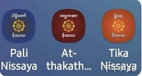

# Nissaya-缅甸佛教的基石

## 概况

>Vinayalaṅkāra ṭīkā nissaya

巴利缅文逐词翻译（缅语：နိဿယ 罗马体转写：Nissaya）。一种翻译文体。是巴利语经文的缅文逐字翻译的著作。不同于常见的逐段或逐句的译文。Nissaya文本格式为：缅文字母写的一个巴利语单词（有时是几个单词）和紧随其后的缅文翻译或解释。通常巴利语单词和缅文翻译之间用缅文逗号（၊）分隔，而两个巴利语单词之间用缅文句号(။)分隔。

>棕色线标出的为巴利语原文

古代Nissaya被刻写在棕榈叶上。近现代出现了纸质版的Nissaya书籍。目前，电子版的Nissaya逐渐借助互联网广泛流通。也出现了手机的Nissaya App。

>三款包含Nissaya的手机App

## 历史

缅甸的Nissaya翻译历史可以追溯到蒲甘王国（缅甸语：ပုဂံခေတ်）时期。在缅甸蒲甘王国，在阿隆悉都这个国王时期就有一位尊者叫做大迦叶尊者。这位大迦叶他也做出了逐字解析的一本经书，叫做是《小学注》译注，逐句的解析(Kuddasikkhā aṭṭhakathā nissaya)，也就是年代是1094年。

在西元的1329年当中呢，也就是介于蒲甘时期跟邦芽时期当中，又出现了一位尊者叫做库那文丹沙加(Gunavaṭaṃsaka)，他也做出了长部的注释逐句的解析。长部注释逐句解析(Dighanikāya aṭṭhakathā nissaya)。

邦芽时期后面的阿瓦时期，还有宫保时期，还有阿玛拉普拉时期当中，在缅甸国除了做了逐句的解析以外，他们也做出了巴利三藏的诗句，还有巴利三藏的赋文，有散文，有各种的题材来讲述巴利三藏。

## 现状

在古代，缅甸的佛经被刻写在棕榈叶上。
我们现在依然可以找到被刻写在棕榈叶上的Nissaya。在缅甸直通（Thaton）的正法之光寺（Sadhamma­jotika Monastery）的吴坡提图书馆（U Pho Thi Library）。藏有大量棕叶经。2013年，一个[项目组](https://mmdl.utoronto.ca/about/the-project-to-digitize/)来此拍摄棕叶经。并将数码照片放到网上供大家下载。这其中就有许多Nissaya。

>吴坡提图书馆

>吴坡提图书馆馆藏的律藏的复註。已经有一百多年的历史

这些资料中，有非常珍贵的尚未出版的Nissaya。如：律藏的律摄(Vinayasaṅgaha),律裁定(Vinayavinicchaya),经藏的《大义释义注》(Mahāniddesa-aṭṭhakathā)

>这部阿毗达摩藏的再复注的逐字翻译（Anuṭīkā Nissaya）尚未出版。

在近代，出现了以纸张为媒介的Nissaya出版物。也是目前用得最广泛的载体。这些已经出版的Nissaya涵盖了根本(Mūla)和大部分义注。

>无碍解道Nissaya，1960年版 现藏于[卡巴耶佛教研究图书馆](http://www.kbrl.gov.mm/)（Kabaaye buddha research library）

有些虽然有棕榈叶版本。还是有现代西亚多重新写过。比较著名的是马哈甘达勇西亚多———贾纳卡阿毗旺萨。他用毕生的精力用来教学和撰写Nissaya。他的Nissaya用比较简明易懂的缅文写成。包括了律藏的根本和义注，经藏长部的根本和义注，阿毗达摩藏的根本义注和复注。马哈希西亚多，写了《清静道论大疏钞》的Nissaya。

这些出版物有些是最近20年排版印刷的，比较清晰。如：《长老尼偈义注》Nissaya《法句经义注》bhāsāṭīkā。在互联网上也出现了少量的[电子版Nissaya](https://palimyanmarpitaka.blogspot.com/2021/05/blog-post_36.html). 大部分这类出版物都有扫描的电子版。

但是这些出版物经过多年重复复制，有些已经字迹不清。有些nissaya没有正式出版。只有棕叶经的手抄版本。

## 价值和应用

缅文的逐字翻译（Nissaya）经过上千年的发展。一代又一代僧侣不断的传承和完善。已经涵盖了全部的根本，义注和部分复注。对于巴利语的学习者带来极大的便利。在缅甸所有的佛学院的学生在学习了基础巴利语语法后。都要使用Nissaya继续学习其他经文。一种常见的做法是，老师会在课堂上念出Nissaya。学生在经书上的行间缝隙里记录下每个词的意思。根据已获得法师（dhammācariya）资格的U Tejañaṇālankara尊者说，这样的训练每天要做8页左右。大量的抄写练习能够加深对于单词的印象。

逐段或逐句的译文一般以表达意思为主要目的。由于巴利语是屈折语（英语：fusional language，或称inflectional language）。在翻译为分析语（英语：analytic language）时需要改变表达方式才能通顺易读。有时不得不在翻译的准确性和流畅性上做出权衡。译文与原文相比，丢失意思信息或语法信息的现象会对学习巴利语的学生造成不便。

而Nissaya不仅仅包含了每个词的意思。也包含了语法信息。在现代汉语中。词是不区分主格和宾格的。缅语的主格和宾格可以通过不同的语尾区分。巴利语中的八个格和单复数都有对应的缅文语尾。

nissaya 缅文语尾表

| 格位 | 单数 | 复数 |
| - | - | - | 
|主格|  သည် ； ကား ； က ； ကို (主语) | တို့သည် တို့ကား  တို့က တို့ကို |  
|呼格|  အို (称呼-喂) | အို --- တို့ |
|宾格| ကို(宾语) ; သို့(趋向) | တို့ကို  တို့သို့ |
|具格| သည်(主语) ； ဖြင့်(用)； **နှင့်**(工具-用，与-with,) ;  ကြောင့်(因为，凭借?)  **နှင့်**  |တို့သည်;တို့ဖြင့် ;တို့နှင့်; တို့ကြောင့် |
|为格| အား (对象-间接宾语) ; ငှာ (目的-为了)  ငှါ(目的-为了) | တို့အား ; တို့ငှါ |
|从格|  မှ(从) ;  ကြောင့် (原因-因为) ； အောက် (比较-比……多) ထက် (比较-比……少)  | တို့မှ တို့ကြောင်ု့  တို့အောက် တို့ထက် |
|属格| ၏ (从属关系-“……的” ； တွင် (处-范围) ; သည် (主语) ; ကို (宾语) | တို၏ တို့တွင် တို့သည် တို့ကို  |
|处格| ( ၌ (在-时间、地点) ； တွင် (在-时间、地点) ；  ကြောင့် (原因-因为) )  | တို့၌ တို့တွင် တို့ကြောင့် |

| 语尾 | 作用 |
| - | - |
| ၍  |  连续体-Tvā |
| တို့-များ-ကုန်-ကြ  |  如果有就是复数 |
| ပတ်လုံး-လုံလုံး  | 时间的整数 |
| တိုင်တိုင်-တိုင်အောင်  |  距离,长度的整数 |
| နေစဉ်  |  同时发生的时间状语 |

不仅如此。Nissaya里面的巴利语单词的顺序与巴利原文不一定相同。有时候会调整单词前后顺序或者增加单词。如下面的句子。括号内的是增加的词。增加的单词是补充原来的句子中省略的成份。对学习者理解原文意思很有帮助。

## 参考资料

### 持三藏法库高僧演讲《》

### visuddhinanda的google drive
>PDF Nissaya下载 以Masoyin e-Libary为基础增补了其他网站的书籍

[google drive](https://drive.google.com/drive/folders/1CJFF8M5E4yFWPnB7RUfLDyMNHFIwlZri?usp=sharing)

### Masoyin e-Libary

> [Masoyin佛学院的](https://en.wikipedia.org/wiki/Masoyein_Monastery)资料下载网站

### Pali Nissaya

>Scan PDF 149 books

https://msy-elibrary.blogspot.com/2020/06/blog-post.html?m=1

### Aṭṭhakatha Nissaya

>Scan PDF 149 books

https://msy-elibrary.blogspot.com/2020/12/blog-post.html?m=1

### Ṭīkā Nissaya

>Scan PDF 35 books

https://msy-elibrary.blogspot.com/2020/12/blog-post_27.html?m=1

### palimyanmarpitaka 

>nissaya soft copy Unicode html

https://palimyanmarpitaka.blogspot.com/2021/05/blog-post_36.html

>- vinaya pali nissaya 5 book
>- vinaya atthakatha nissaya 5 book
>- visuddhimagga-mahatika nissaya 2 book

### Dhamma Download

>缅甸知名的佛教媒体下载站

http://dhammadownload.com/

### Kabaaye Buddha Research Library

>**卡巴耶佛教研究图书馆**位于仰光 Mayangone 镇 Kaba Aye Hill Estate 的第六次圣典结集 Mahapasana Cave 以北。专为佛教研究建立的图书馆。馆藏2万多。亦将部分馆藏制作成了扫描版的电子书。可在官网下载。

http://www.kbrl.gov.mm/Catalog/Featured

### dhammaebook

> 个人博客 里面包含一些非unicode电子版nissaya

https://dhammaebook.blogspot.com/2020/06/blog-post_3.html?spref=fb&fbclid=IwAR1bYdVwldA9kYGu0VJBQ3e2XZGS4_wbmWkTc-Vac_osBKXMRku-Re85nMU

https://spsuygn.edu.mm/book/ref_sub/24?page=2

### Myanmar Manuscript Digital Library, MMDL

> This archive, hosted by the University of Toronto and supported by Robarts Library, aims at bringing together and making manuscripts and rare print editions available online from individual libraries throughout Myanmar. It is the platform for an ongoing digitizing project, initiated and conducted by William Pruitt and an international team of Myanmar and Pali scholars, and supported, since 2012, by the Pali Text Society, as well as by Yumi Ousaka of the Sendai National College of Technology, the KDDI Foundation, the Mitsubishi Foundation, the CARI Foundation, and JSPS Kakenhi.

> 数字化缅文书的项目。其中包含佛教的贝叶经的电子化版本（贝叶经照片）

https://mmdl.utoronto.ca/